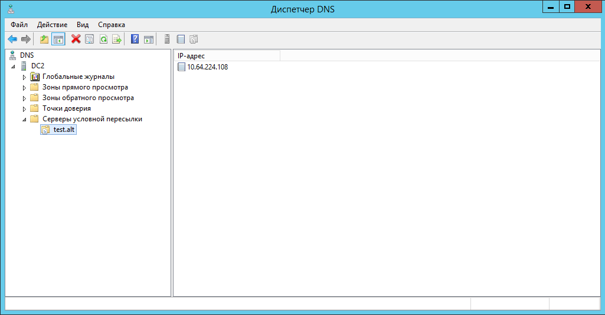
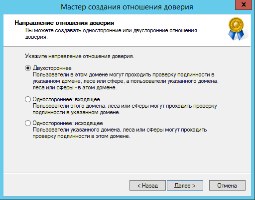
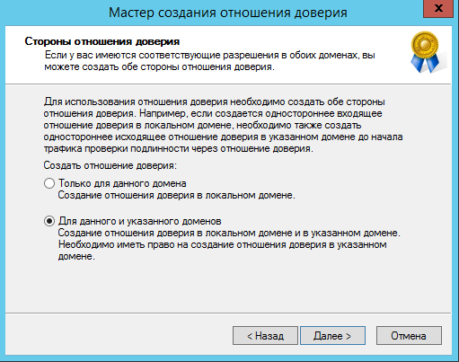
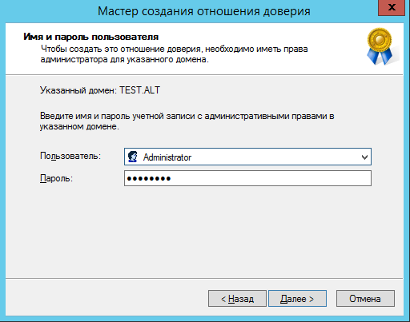
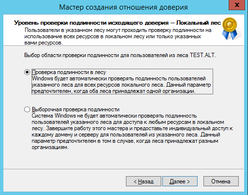
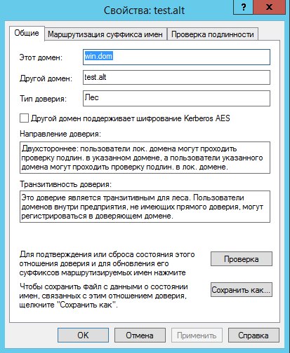
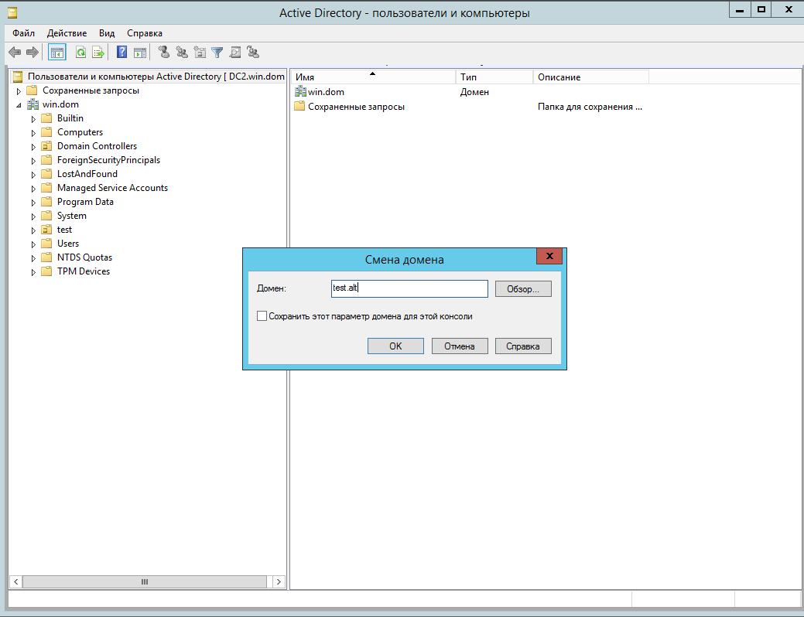
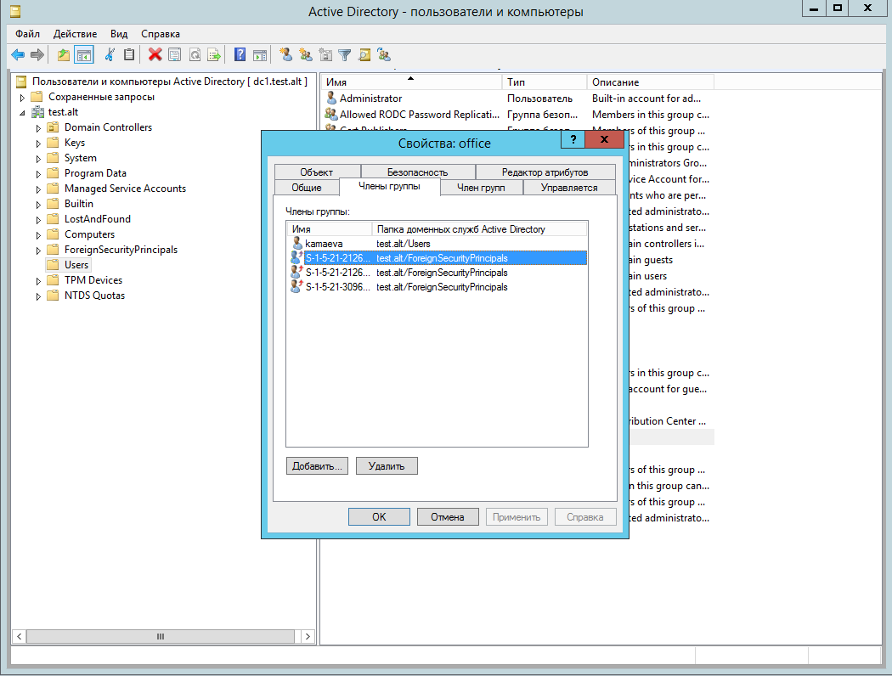
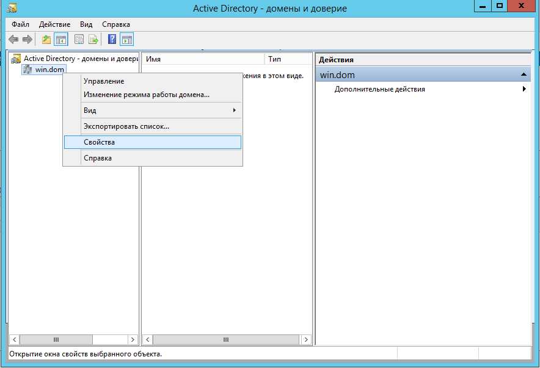

## Поддержка доверительных отношений с Samba

**Поддерживается:**

+ Доверительное отношение между лесами доменов (forest trust). Это доверие может быть установленным между двумя Samba-доменами или Samba-доменом и Windows-доменом.
+ Внешние доверительные отношения (external trust). Это доверие может быть установленным между двумя Samba-доменами или Samba-доменом и Windows-доменом.
+  Добавление пользователей и групп доверенного домена в группы доверяющего домена, но при этом необходимо использовать SID пользователей и групп, чтобы добавить их в свою группу (имя пользователя или имя группы использовать невозможно).
+ В RSAT появится контейнер ForeignSecurityPrincipal для всех добавленных пользователей и групп из доверенного домена. Таким образом Microsoft показывает, что пользователь или группа являются частью доверенного домена.

**Особенности и ограничения:**

+ Для входа в доверенный домен через SSSD надо использовать тип связи External, а не Forest;
+ Не применяются правила фильтрации SID;
+ Обе стороны траста должны полностью доверять друг другу. Это означает, что администратор из домена A может управлять всеми объектами в домене Б и наоборот;
+ Выборочная аутентификация в настоящий момент не поддерживается. Возможно создание таких доверий, но KDC и winbindd всё равно будут их игнорировать;
+ Нельзя создать доверительные отношения между доменами в одном дереве с одним и тем же пространством имён верхнего уровня. NetBIOS имена доменов должны отличаться (домен MYDOMAIN.WIN и MYDOMAIN.NEW будут иметь одинаковое короткое имя — MYDOMAIN, это приведет к невозможности установки доверительных отношений);
+ Winbind на клиентских машинах не распознаёт доверенные домены, что приводит к проблемам с обновлением паролей учетных записей доверенного домена после их истечения. Чтобы устранить эту проблему, необходимо внести изменения в конфигурационный файл smb.conf на Linux-клиентах, подключенных через Winbind. В секции [global] этого файла следует добавить соответствующую опцию:

	  winbind scan trusted domains = yes

Перезапустить сервис winbind:

	#systemctl restart winbind.service

+ При использовании групповой политики (на контроллерах в win-домене) "Сетевая безопасность: минимальная сеансовая безопасность для серверов на базе NTLM SSP (включая безопасный RPC)" с опцией "требовать сеансовую безопасность NTLMv2" в разделе "Конфигурация компьютера\Конфигурация Windows\Параметры безопасности\Локальные политики\Параметры безопасности" не строится траст между win-доменом и samba-доменом. При включении этой политики после построения траста некорректно работают доверительные отношения между windows-доменом и samba-доменом. Не выполняется проверка траста (samba-tool domain trust validate) и не выполняется вход на пользователями из доверенного домена на машинах с winbind. **Примечание:** После редактирования политики и ее применения на win-домене необходимо перезапустить сервис samba.

Для управления доверием можно использовать инструмент командной строки **samba-tool**.
⁠
| Команда                       | Описание                                      | Примечание                                                                                                                                                                                                                                                                                                                                                                                                                                                                     |
|-------------------------------|-----------------------------------------------|--------------------------------------------------------------------------------------------------------------------------------------------------------------------------------------------------------------------------------------------------------------------------------------------------------------------------------------------------------------------------------------------------------------------------------------------------------------------------------|
| domain trust create <домен>   | Создать доверие домена или леса               | Можно использовать следующие опции:  --type=TYPE — тип доверия (external,forest);   --direction=DIRECTION — направление доверия (incoming,outgoing,both);  --create-location=LOCATION  — где создать объект доверенного домена (local,both);  --quarantined=yes\|no — применять к доверию специальные правила фильтрации SID  (при --type=external по умолчанию yes,  при --type=forest по умолчанию no);  -U USERNAME — имя пользователя. |
| domain trust modify <домен>   | Изменить доверие домена или леса              |                                                                                                                                                                                                                                                                                                                                                                                                                                                                                |
| domain trust delete <домен>   | Удалить доверие домена или леса               | Можно использовать следующие опции:  --delete-location=LOCATION  — где удалить объект доверенного домена (local, both);  -U USERNAME — имя пользователя.                                                                                                                                                                                                                                                                                                           |
| domain trust list             | Вывести список доверительных отношений домена |                                                                                                                                                                                                                                                                                                                                                                                                                                                                                |
| domain trust show <домен>     | Показать сведения о доверенном домене         |                                                                                                                                                                                                                                                                                                                                                                                                                                                                                |
| domain trust validate <домен> | Проверить доверие к домену                    | Можно использовать следующие опции:  --validate-location=LOCATION — где проверить объект доверенного домена ( local, both);  -U USERNAME — имя пользователя.                                                                                                                                                                                                                                                                                                    |

## Доверительные отношения между Samba DC и Windows Server с Active Directory

Установка доверительных отношений между Windows 2012R2 и SambaDC

> Внимание! Для входа в доверенный домен через SSSD надо использовать тип связи external, а не forest.

+ Домен Windows:

	Имя домена - WIN.DOM

	Контроллер домена - DC2.WIN.DOM

	IP address - 10.64.224.116

	ОС контроллера домена - Windows Server 2012R2

	 Уровень работы домена - 2012R2

+ Домен Linux:

  Имя домена - TEST.ALT

  Контроллер домена - DC1.TEST.ALT

  IP address - 10.64.224.108

  ОС контроллера домена - Alt Server 10.2

  Уровень работы домена - 2012_R2

  Версия Samba - 4.19.7
___

#### Настройка DNS

+ **Windows Server с AD**

На AD сервере создать сервер условной пересылки для зоны Samba домена.

**В графическом интерфейсе:**

1. Открыть Диспетчер DNS (DNS Manager).
2. В разделе Серверы условной пересылки (Conditional Forwarders) добавить новый сервер пересылки, указав FQDN или IP-адрес сервера Samba:

3. Сохранить настройки.

**В командной строке:**

	PS$ Add-DnsServerConditionalForwarderZone -Name lin.loc -MasterServers 172.16.100.135 -ReplicationScope Forest

+ **Samba DC**
1. Создать сервер условной перессылки для службы DNS.

+ При использовании **DNS бэкенда BIND9_DLZ** добавить в конец файла /etc/bind/options.conf (или /etc/bind/ddns.conf) строки:

		zone "win.dom" in {
		type forward;
			forwarders { 10.64.224.116; };
		};

  И перезапустить службу DNS:

		# systemctl restart bind.service

+ Если используется **DC с DNS бэкенд SAMBA_INTERNAL**, самый простой способ заставить работать разрешение имен — настроить DNS-прокси между двумя доменами. DNS-прокси будет перенаправлять запрос между доменами и внешним DNS-серверами. В примере, в качестве DNS-прокси используется отдельный сервер (IP-адрес 10.64.224.105) с настроенным bind9.

На контроллере домена необходимо выполнить следующие действия:

1. Указать DNS-прокси, как сервер пересылки в файле /etc/samba/smb.conf (в параметре dns forwarder). Например:

		dns forwarder = 10.64.224.105 8.8.8.8

2. Перезапустить службу samba:

		# systemctl restart samba

На сервере bind9:

1. Отредактировать файл /etc/bind/options.conf:

	+	Отключить проверку DNSSEC, для этого в секцию options добавить параметр:

			dnssec-validation no;

	+ В конец файла добавить информацию о зонах:

			zone "win.dom" in {
				type forward;
				forwarders { 10.64.224.116; };
			};

 2. Перезапустить службу DNS:

		# systemctl restart bind.service

Подробнее про настройку домена можно прочесть в [документации ALT Linux Team](https://docs.altlinux.org/ru-RU/archive/9.0/html/alt-server/)

> Если удалённый DNS-сервер не использует DNSSEC и включить проверку DNSSEC на удаленном DNS-сервере нельзя, можно отключить проверку DNSSEC на сервере AD. Для этого необходимо в файл /etc/bind/options.conf в секцию options добавить параметр:

	 dnssec-validation no;

>  И перезапустить службу DNS:

	# systemctl restart bind.service

+ **Проверка конфигурации DNS**

**На Samba DC:**

1. Запись отвечающая за работу сервисов Kerberos через UDP и LDAP через TCP:

		# dig +short -t SRV _kerberos._udp.test.alt
		0 100 88 dc1.test.alt.
		# dig +short -t SRV _ldap._tcp.test.alt
		0 100 389 dc1.test.alt.

В выводе команд должен быть отображен список всех серверов.

2. Наличие записей для работы сервисов AD на DNS-сервере Samba:

		# dig +short -t SRV _kerberos._tcp.dc._msdcs.win.dom
		0 100 88 dc1.win.dom.
		# dig +short -t SRV _ldap._tcp.dc._msdcs.win.dom
		0 100 389 dc1.win.dom.

3. Возможность получения билета Kerberos в домене WIN.DOM:

		# kinit Администратор@WIN.DOM
		# klist
		Ticket cache: FILE:/tmp/krb5cc_500
		Default principal: Администратор@WIN.DOM

		Valid starting       Expires              Service principal
		09.09.2024 15:49:11  10.09.2024 01:49:11  krbtgt/WIN.DOM@WIN.DOM
			renew until 10.09.2024 15:49:01

**На Windows Server с AD:**

1. Запустить утилиту nslookup.exe для поиска служебных записей:

		C:\> nslookup.exe
		> set type=SRV

2. Ввести доменное имя для служебных записей Kerberos через UDP и LDAP через TCP:

		> _kerberos._udp.test.alt
		_kerberos._udp.test.alt       SRV service location:
			priority                = 0
			weight                  = 100
			port                    = 88
			svr hostname            = dc1.test.alt
		…
		test.alt
			primary name server = dc1.test.alt
			responsible mail addr = hostmaster.test.alt
			serial = 7
			refresh = 900 (15 mins)
			retry = 600 (10 mins)
			expire = 86400 (1 days)
			default TTL = 3600 (1 hours)
		> _ldap._tcp.test.alt
		_ldap._tcp.test.alt       SRV service location:
			priority                = 0
			weight                  = 100
			port                    = 389
			svr hostname            = dc1.test.alt

#### Создание двухстороннего транзитивного подключения

+ **на Samba DC**

На контроллере домена dc1.test.alt:

	# samba-tool domain trust create win.dom --type=forest --direction=both --create-location=both -Uадминистратор@WIN.DOM

где:

+ **--type** - указывает тип доверительного отношения, может принимать значения external и forest.
+ **--direction** - определяет направление доверительного отношения.
	+ incoming - входящее доверие
	+ outgoing - исходящее доверие
	+ both - двустороннее доверие
+ **--create-location** - указывает место создания доверительного отношения.
	+ local - объект доверенного домена будет создан только в локальном домене,  доверительные отношения будут зарегистрированы и настроены только со стороны вашего домена, без внесения изменений в конфигурацию удаленного домена.
	+ both - объект доверенного домена будет создан в обоих доменах.

При появлении запроса необходимо ввести пароль администратора.

> Для входа в доверенный домен через SSSD надо использовать тип связи external, а не forest.

> В случае использования Trust Secret Key в параметре --create-location нужно заменить опцию both на local. Samba DC прежде чем создать доверительные отношения сначала запросит Trust Key (Incoming Trust Password/Outgoing Trust Password), созданный ранее при настройке в Windows.

**На Windows Server с AD:**

В домене win.dom открываем «Диспетчер серверов», и выбираем «Средства» — «Active Directory — Домены и Доверие»:

В открывшемся окне в контекстном меню домена WIN.DOM необходимо выбрать «Свойства». Откроется окно свойств, в котором нужно перейти во вкладку «Отношения доверия» и нажать на «Создать отношение доверия»:

В открывшемся мастере создания отношения доверия вводим имя домена Samba DC. В данном случае TEST.ALT:

На следующей вкладке «Тип доверия» выбираем «Доверие леса»:

Далее во кладке «Направление отношения доверия» выбираем «Двухстороннее»:

В открывшемся окне «Стороны отношения доверия» необходимо выбрать, на каком из доменов будет применена настройка. В нашем случае у нас есть права администратора для обоих доменов, поэтому выбираем пункт «Для данного и указанного домена».

Если был выбран параметр «Только для данного домена», то необходимо будет задать Trust Secret Key, который в дальнейшем будет использоваться при создании доверительного отношения на стороне Samba DC.

На следующем этапе мастер свяжется с доменом TEST.ALT (если он доступен), и запросит логин и пароль от пользователя с правами установки доверительных отношений в домене TEST.ALT:

Далее на вкладке «Уровень проверки подлинности исходящего доверия — Локальный лес» выбираем «Проверка подлинности в лесу»:

Тоже самое выбираем и на следующей вкладке «Уровень проверки подлинности исходящего доверия — Указанный лес».

После очередного нажатия на кнопку «Далее» мастер в окне «Выбор доверия завершен» выдаст уведомление о том, что готов создать новое отношение доверия, и покажет краткую сводку по выбранным параметрам. Соглашаемся с параметрами, после чего должно появиться уведомление о том, что создание доверия успешно завершено:

После нажатия на «Далее» появится окно «Подтверждение исходящего доверия», а после него «Подтверждение входящего отношения доверия». Здесь и в первом и во втором окне оставляем «Нет, не подтверждаю это исходящее/входящее отношение доверие», так как на стороне Samba DC доверие нами еще не создавалось:

Отношение доверия успешно создано:

##### Проверка доверия

Проверка доверия с dc1.test.alt:

+ просмотр доверия:

		# samba-tool domain trust show WIN.DOM
		LocalDomain Netbios[TEST] DNS[test.alt] SID[S-1-5-21-3099202228-3607437695-3279060739]
		TrustedDomain:

		NetbiosName:    WIN-DOM
		DnsName:        win.dom
		SID:            S-1-5-21-3096440084-565096806-4224734732
		Type:           0x2 (UPLEVEL)
		Direction:      0x3 (BOTH)
		Attributes:     0x8 (FOREST_TRANSITIVE)
		PosixOffset:    0x00000000 (0)
		kerb_EncTypes:  0x18 (AES128_CTS_HMAC_SHA1_96,AES256_CTS_HMAC_SHA1_96)
		Namespaces[2] TDO[win.dom]:
		TLN: Status[Enabled]                  DNS[*.win.dom]
		DOM: Status[Enabled]                  DNS[win.dom] Netbios[WIN-DOM] SID[S-1-5-21-3096440084-565096806-4224734732]

+ список трастов:

		# samba-tool domain trust list
		Type[Forest]   Transitive[Yes] Direction[BOTH]     Name[win.dom]

В разных доменах могут быть разные результаты. Результат зависит от типа траста, который установлен с этим доменом.
Если после настройки доверия возникли проблемы с доступом пользователей из трастового домен в свой домен, тогда следует проверить, действительно ли установлен траст:

		# samba-tool domain trust validate win.dom -UАдминистратор@WIN.DOM
		LocalDomain Netbios[TEST] DNS[test.alt] SID[S-1-5-21-3099202228-3607437695-3279060739]
		LocalTDO Netbios[WIN-DOM] DNS[win.dom] SID[S-1-5-21-3096440084-565096806-4224734732]
		OK: LocalValidation: DC[\\DC2.win.dom] CONNECTION[WERR_OK] TRUST[WERR_OK] VERIFY_STATUS_RETURNED
		OK: LocalRediscover: DC[\\DC2.win.dom] CONNECTION[WERR_OK]
		RemoteDC Netbios[DC2] DNS[DC2.win.dom] 		ServerType[PDC,GC,LDAP,DS,KDC,TIMESERV,CLOSEST,WRITABLE,FULL_SECRET_DOMAIN_6,ADS_WEB_SERVICE,DS_8,DS_9]
		Password for [Администратор@WIN.DOM]:
		OK: RemoteValidation: DC[\\dc1.test.alt] CONNECTION[WERR_OK] TRUST[WERR_OK] VERIFY_STATUS_RETURNED
		OK: RemoteRediscover: DC[\\dc1.test.alt] CONNECTION[WERR_OK]

Проверка доверия с dc2.win.dom:

Проверку можно осуществить в свойствах домена WIN.DOM во вкладке «Отношения доверия».

:

Необходимо выбрать домен, который вы хотите проверить и нажать «Свойства»:

Для подтверждения или сброса состояния этого отношения доверия и для обновления его суффиксов маршрутизируемых имен необходимо нажать «Проверка»:

## Доверительные отношения между двумя доменами на основе Samba

| Имя домена  | Контроллер домена | IP-адрес      | ОС контроллера домена | Версия Samba |
|-------------|-------------------|---------------|-----------------------|--------------|
| TEST.ALT    | DC1.TEST.ALT      | 10.64.224.118 | ALT Server 10.2       | 4.19.7       |
| EXAMPLE.ALT | DC2.EXAMPLE.ALT      | 10.64.224.117 | ALT Server 10.2       | 4.19.7       |

#### Настройка DNS

+ Если используется **DNS бэкенд BIND9_DLZ**, необходимо добавить информацию о зоне в конец файла /etc/bind/options.conf:

	на контроллере домена dc1.test.alt добавить строки:

		zone "example.alt" {
			type forward;
			forwarders { 10.64.224.117; };
		};

	на контроллере домена dc2.example.alt:

		zone "test.alt" {
			type forward;
			forwarders { 10.64.224.118; };
		};

	Перезапустить службу DNS:

		# systemctl restart bind.service

> Если удалённый DNS-сервер не использует DNSSEC и включить проверку DNSSEC на удаленном DNS-сервере нельзя, можно отключить проверку DNSSEC на сервере AD. 
Для этого необходимо в файле /etc/bind/options.conf в секцию options добавить параметр:

	dnssec-validation no;

> И перезапустить службу DNS:

	# systemctl restart bind.service

+ Если используется **DC с DNS бэкенд SAMBA_INTERNAL**, самый простой способ заставить работать разрешение имен — настроить DNS-прокси между двумя доменами. DNS-прокси будет перенаправлять запрос между доменами и внешним DNS-серверами. В примере, в качестве DNS-прокси используется отдельный сервер (IP-адрес 192.168.0.150) с настроенным bind9.

На каждом контроллере домена необходимо:

1. Указать DNS-прокси, как сервер пересылки в файле /etc/samba/smb.conf (в параметре dns forwarder). Например:

		dns forwarder = 10.64.224.105 8.8.8.8

2. Перезапустить службу samba:

		# systemctl restart samba

На сервере bind9 отредактировать файл /etc/bind/options.conf:

+ отключить проверку DNSSEC, для этого в секцию options добавить параметр:

		dnssec-validation no;

+ в конец файла добавить информацию о зонах:

		zone "example.alt" {
			type forward;
			forwarders { 10.64.224.117; };
		};

		zone "test.alt" {
			type forward;
			forwarders { 10.64.224.118; };
		};

Перезапустить службу DNS:

	# systemctl restart bind.service

##### Проверка конфигурации DNS

Для проверки настройки следует убедиться, что на обоих контроллерах домена разрешаются SRV-записи:

+ на контроллере домена dc1.test.alt:

		# host -t srv _kerberos._tcp.example.alt
		_kerberos._tcp.example.alt has SRV record 0 100 88 dc2.example.alt.
		# host -t srv _kerberos._tcp.test.alt
		_kerberos._tcp.test.alt has SRV record 0 100 88 dc1.test.alt.

+ на контроллере домена dc2.example.alt:

		# host -t srv _kerberos._tcp.example.alt
		_kerberos._tcp.test.alt has SRV record 0 100 88 dc2.example.alt.
		# host -t srv _kerberos._tcp.test.alt
		_kerberos._tcp.test.alt has SRV record 0 100 88 dc1.test.alt.

Проверка возможности получения билета Kerberos:

+ на контроллере домена dc1.test.alt:

		# kinit administrator@EXAMPLE.ALT
		Password for administrator@EXAMPLE.ALT:
		# klist
		Ticket cache: FILE:/tmp/krb5cc_0
		Default principal: administrator@EXAMPLE.ALT

		Valid starting       Expires              Service principal
		10.09.2024 16:48:51  11.09.2024 02:48:51  krbtgt/EXAMPLE.ALT@EXAMPLE.ALT
			renew until 11.09.2024 16:48:47

+ на контроллере домена dc1.test.alt:

		# kinit administrator@TEST.ALT
		Password for administrator@TEST.ALT:
		# klist
		Ticket cache: KEYRING:persistent:0:0
		Default principal: administrator@TEST.ALT

		Valid starting       Expires              Service principal
		10.09.2024 14:02:21  11.09.2024 00:02:21  krbtgt/TEST.ALT@TEST.ALT
			renew until 17.09.2024 14:02:17

> *Важно:* realm должен быть записан заглавными буквами.

#### Создание двухстороннего транзитивного подключения

**Для входа в доверенный домен через Winbind**

На контроллере домена dc1.test.alt:

		#  samba-tool domain trust create EXAMPLE.ALT --type=forest --direction=both --	create-location=both -U administrator@EXAMPLE.ALT
		LocalDomain Netbios[TEST] DNS[test.alt] SID[S-1-5-21-3099202228-3607437695-3279060739]
		RemoteDC Netbios[DC2] DNS[dc2.example.alt]
		ServerType[PDC,GC,LDAP,DS,KDC,TIMESERV,CLOSEST,WRITABLE,GOOD_TIMESERV,FULL_SECRET_DOMAIN_6]
		Password for [administrator@EXAMPLE.ALT]:
		RemoteDomain Netbios[EXAMPLE] DNS[example.alt] SID[S-1-5-21-2126352409-2047936676-1054754669]
		Creating remote TDO.
		Remote TDO created.
		Setting supported encryption types on remote TDO.
		Creating local TDO.
		Local TDO created
		Setting supported encryption types on local TDO.
		Setup local forest trust information...
		Namespaces[2] TDO[example.alt]:
		TLN: Status[Enabled]                  DNS[*.example.alt]
		DOM: Status[Enabled]                  DNS[example.alt] Netbios[EXAMPLE] SID[S-1-5-21-2126352409-2047936676-1054754669]
		Setup remote forest trust information...
		Namespaces[2] TDO[test.alt]:
		TLN: Status[Enabled]                  DNS[*.test.alt]
		DOM: Status[Enabled]                  DNS[test.alt] Netbios[TEST] SID[S-1-5-21-3099202228-3607437695-3279060739]
		Validating outgoing trust...
		OK: LocalValidation: DC[\\dc2.example.alt] CONNECTION[WERR_OK] TRUST[WERR_OK] VERIFY_STATUS_RETURNED
		Validating incoming trust...
		OK: RemoteValidation: DC[\\dc1.test.alt] CONNECTION[WERR_OK] TRUST[WERR_OK] VERIFY_STATUS_RETURNED
		Success.

**Для входа в доверенный домен через SSSD**

Для входа в доверенный домен через SSSD надо использовать тип связи external, а не forest.

	# samba-tool domain trust create EXAMPLE.ALT --type=external --direction=both --create-location=both -U administrator@EXAMPLE.ALT

где:

+ **--type** - указывает тип доверительного отношения, может принимать значения external и forest.
+ **--direction** - определяет направление доверительного отношения.
	+ incoming - входящее доверие
	+ outgoing - исходящее доверие
	+ both - двустороннее доверие
+ **--create-location** - указывает место создания доверительного отношения.
	+ local - объект доверенного домена будет создан только в локальном домене,  доверительные отношения будут зарегистрированы и настроены только со стороны вашего домена, без внесения изменений в конфигурацию удаленного домена.
	+ both - объект доверенного домена будет создан в обоих доменах.

	
**Проверка доверия:**

+ Просмотр доверия с dc1.test.alt:

		[root@dc1 ~]# samba-tool domain trust show EXAMPLE.ALT
		LocalDomain Netbios[TEST] DNS[test.alt] SID[S-1-5-21-3099202228-3607437695-3279060739]
		TrustedDomain:

		NetbiosName:    EXAMPLE
		DnsName:        example.alt
		SID:            S-1-5-21-2126352409-2047936676-1054754669
		Type:           0x2 (UPLEVEL)
		Direction:      0x3 (BOTH)
		Attributes:     0x8 (FOREST_TRANSITIVE)
		PosixOffset:    0x00000000 (0)
		kerb_EncTypes:  0x18 (AES128_CTS_HMAC_SHA1_96,AES256_CTS_HMAC_SHA1_96)
		Namespaces[2] TDO[example.alt]:
		TLN: Status[Enabled]                  DNS[*.example.alt]
		DOM: Status[Enabled]                  DNS[example.alt] Netbios[EXAMPLE] SID[S-1-5-21-2126352409-2047936676-1054754669]

+ Просмотр доверия с dc2.example.alt:

		[root@dc2 ~]# samba-tool domain trust show TEST.ALT
		LocalDomain Netbios[EXAMPLE] DNS[example.alt] SID[S-1-5-21-2126352409-2047936676-1054754669]
		TrustedDomain:

		NetbiosName:    TEST
		DnsName:        test.alt
		SID:            S-1-5-21-3099202228-3607437695-3279060739
		Type:           0x2 (UPLEVEL)
		Direction:      0x3 (BOTH)
		Attributes:     0x8 (FOREST_TRANSITIVE)
		PosixOffset:    0x00000000 (0)
		kerb_EncTypes:  0x18 (AES128_CTS_HMAC_SHA1_96,AES256_CTS_HMAC_SHA1_96)
		Namespaces[2] TDO[test.alt]:
		TLN: Status[Enabled]                  DNS[*.test.alt]
		DOM: Status[Enabled]                  DNS[test.alt] Netbios[TEST] SID[S-1-5-21-3099202228-3607437695-3279060739]

+ Список трастов:

		[root@dc1 ~]# samba-tool domain trust list
		Type[Forest]   Transitive[Yes] Direction[BOTH]     Name[example.alt]

В разных доменах могут быть разные результаты. Результат зависит от типа траста, который установлен с этим доменом.

Если после настройки доверия возникли проблемы с доступом пользователей из трастового домен в свой домен, тогда следует проверить, действительно ли установлен траст:

	[root@dc1 ~]# samba-tool domain trust validate EXAMPLE.ALT -Uadministrator@EXAMPLE.ALT
	LocalDomain Netbios[TEST] DNS[test.alt] SID[S-1-5-21-3099202228-3607437695-3279060739]
	LocalTDO Netbios[EXAMPLE] DNS[example.alt] SID[S-1-5-21-2126352409-2047936676-1054754669]
	OK: LocalValidation: DC[\\dc2.example.alt] CONNECTION[WERR_OK] TRUST[WERR_OK] VERIFY_STATUS_RETURNED
	OK: LocalRediscover: DC[\\dc2.example.alt] CONNECTION[WERR_OK]
	RemoteDC Netbios[DC2] DNS[dc2.example.alt]
	ServerType[PDC,GC,LDAP,DS,KDC,TIMESERV,CLOSEST,WRITABLE,GOOD_TIMESERV,FULL_SECRET_DOMAIN_6]
	Password for [administrator@EXAMPLE.ALT]:
	OK: RemoteValidation: DC[\\dc1.test.alt] CONNECTION[WERR_OK] TRUST[WERR_OK] VERIFY_STATUS_RETURNED
	OK: RemoteRediscover: DC[\\dc1.test.alt] CONNECTION[WERR_OK]

## Управление пользователями и группами

После настройки доверия можно назначать пользователей и группы из доверяющего домена в группу доверенного домена. Так как настроено двустороннее доверие, можно назначать пользователей и группы в обоих направлениях.

> Предварительно необходимо создать несколько пользователей и групп в обоих доменах. Инструкцию можно найти в [документации ALT Linux Team](https://docs.altlinux.org/ru-RU/domain/10.2/html/samba/ch06.html#users-management)

### Список пользователей и групп

C помощью команды wbinfo можно получить список пользователей и групп только из своего домена (нельзя получить список пользователей и групп из доверяющего домена). Пример получения списка пользователей:

+ на контроллере домена dc1.test.alt:

		# wbinfo -u --domain=TEST.ALT
		TEST\administrator
		TEST\guest
		TEST\krbtgt
		TEST\dns-dc1
		TEST\ivanov

+ на контроллере домена dc2.example.alt:

		# wbinfo -u --domain=EXAMPLE.ALT
		EXAMPLE\administrator
		EXAMPLE\guest
		EXAMPLE\krbtgt
		EXAMPLE\dns-dc2
		EXAMPLE\petrov

Для получения списка всех пользователей можно выполнить LDAP-запрос с помощью команды samba-tool. Пример получения списка пользователей из обоих доменов на контроллере домена dc1.test.alt:

	# samba-tool user list -H ldap://dc1 -Uadministrator@TEST.ALT
	Password for [administrator@TEST.ALT]:
	dns-dc1
	krbtgt
	Guest
	Administrator
	ivanov

	# samba-tool user list -H ldap://dc2 -Uadministrator@EXAMPLE.ALT
	Password for [administrator@EXAMPLE.ALT]:
	petrov
	Administrator
	krbtgt
	dns-dc2
	Guest

Получение дополнительной информации о доменах (в примере команды выполняются на контроллере домена dc1.test.alt):

	# wbinfo --all-domains
	BUILTIN
	TEST
	EXAMPLE

	# wbinfo --own-domain
	TEST

	# wbinfo --trusted-domains
	BUILTIN
	TEST
	EXAMPLE

	# wbinfo --online-status
	BUILTIN : active connection
	TEST : active connection
	EXAMPLE : active connection

Получение SID пользователей и групп (в примере команды выполняются на контроллере домена dc1.test.alt):

	# wbinfo -n TEST\\ivanov
	S-1-5-21-3099202228-3607437695-3279060739-1106 SID_USER (1)

	# wbinfo -n EXAMPLE\\petrov
	S-1-5-21-2126352409-2047936676-1054754669-1105 SID_USER (1)

	# wbinfo -n TEST\\office
	S-1-5-21-3099202228-3607437695-3279060739-1109 SID_DOM_GROUP (2)

	# wbinfo -n EXAMPLE\\office2
	S-1-5-21-3274802069-598906262-3677769431-1107 SID_DOM_GROUP (2)

	# wbinfo -i TEST\\ivanov
	TEST.ALT\ivanov:*:3000029:100::/home/TEST.ALT/ivanov:/bin/false

	# wbinfo -i EXAMPLE\\petrov
	EXAMPLE\petrov:*:3000019:100::/home/EXAMPLE/petrov:/bin/false

### Тестирование аутентификации
**На Samba DC**

 С помощью команды **wbinfo** можно протестировать процесс аутентификации разных пользователей из обоих доменов.

**wbinfo** попытается авторизовать пользователя. 

Первой проверкой будет аутентификация по паролю с открытым текстом. Этот тип аутентификации применяется, когда пользователь входит в систему локально (plaintext не означает, что пароль будет отправлен без шифрования, это просто название процесса входа в систему). Вторая проверка — аутентификация по паролю запрос/ответ. Этот тип аутентификации использует NTLM или Kerberos.

Проверка методов аутентификации (в примере команды выполняются на контроллере домена dc1.test.alt):

	# wbinfo -a TEST\\ivanov
	Enter TEST\ivanov's password:
	plaintext password authentication succeeded
	Enter TEST\ivanov's password:
	challenge/response password authentication succeeded

	# wbinfo -a EXAMPLE\\petrov
	Enter EXAMPLE\petrov's password:
	plaintext password authentication succeeded
	Enter EXAMPLE\petrov's password:
	challenge/response password authentication succeeded

Посмотреть какие контроллеры домена отвечают за аутентификацию:

	# wbinfo --ping-dc
	checking the NETLOGON for domain[TEST] dc connection to "dc1.test.alt" succeeded

	# wbinfo --ping-dc --domain=EXAMPLE.ALT
	checking the NETLOGON for domain[EXAMPLE.ALT] dc connection to "dc2.example.alt" succeeded

Назначение пользователей и групп из доверенных доменов в группу доверяющего домена:

	# wbinfo -n EXAMPLE\\petrov
	S-1-5-21-2126352409-2047936676-1054754669-1105 SID_USER (1)

	# samba-tool group addmembers office S-1-5-21-2126352409-2047936676-1054754669-1105
	Added members to group office

	# wbinfo -n EXAMPLE\\office2
	S-1-5-21-2126352409-2047936676-1054754669-1106 SID_DOM_GROUP (2)

	# samba-tool group addmembers office S-1-5-21-2126352409-2047936676-1054754669-1106
	Added members to group office

	# samba-tool group listmembers office
	S-1-5-21-2126352409-2047936676-1054754669-1105
	S-1-5-21-2126352409-2047936676-1054754669-1106

**На Windows Server**

В модуле RSAT «Active Directory — пользователи и компьютеры» («Active Directory — Users and Computers») можно просмотреть список пользователей группы:

Для этого необходимо сменить домен:

Выбираем «Пользователи и компьютеры Active Directory» и через «Действие» или правую кнопку мыши «Сменить домен...»:

И просматриваем необходимую информацию:

## Использование трастов на LINUX-клиентах

> Если необходимо использовать пользователей из обоих доменов (установлены двухсторонние доверительные отношения с типом связи Лес), то рабочую станцию с ОС Альт следует вводить в домен через Winbind (см. [Подключение к AD с помощью Samba Winbind](https://docs.altlinux.org/ru-RU/domain/10.2/html/samba/client-winbind.html)).

### Winbind

Важно правильно спланировать диапазоны идентификаторов (UID и GID), назначаемых пользователям и группам. Для чего это нужно и как это сделать, можно прочитать  [в статье IDMapping](https://www.altlinux.org/Winbind/IDMapping).

На машине, введённой в домен, необходимо в файле smb.conf установить ID-маппинг для обоих доменов.

 Пример файла smb.conf на машине введённой в домен test.alt:

	[global]
        security = ads
        realm = TEST.ALT
        workgroup = TEST
        netbios name = WS
        template shell = /bin/bash
        kerberos method = system keytab
        wins support = no
        winbind use default domain = yes
        winbind enum users = no
        winbind enum groups = no
        template homedir = /home/%D/%U
        winbind refresh tickets = yes
        winbind offline logon = yes
        idmap config * : range = 3000-7999
        idmap config * : backend = tdb

        idmap config TEST : backend = rid
        idmap config TEST : range = 10000-999999
        idmap config EXAMPLE : backend = rid
        idmap config EXAMPLE : range = 1000000-9999999

После перезапуска smb, nmb, winbind можно проверить, есть ли возможность просматривать пользователей из обоих доменов:

	# net rpc trustdom list -Uadministrator
	Password for [TEST\administrator]:
	Trusted domains list:

	EXAMPLE             S-1-5-21-2126352409-2047936676-1054754669

	Trusting domains list:

	EXAMPLE             S-1-5-21-3096440084-565096806-4224734732

	# wbinfo -n TEST\\ivanov
	S-1-5-21-3099202228-3607437695-3279060739-1125 SID_USER (1)

	# wbinfo -n EXAMPLE\\petrov
	S-1-5-21-2126352409-2047936676-1054754669-1105 SID_USER (1)

Проверка с помощью **getent**:

	# getent group TEST\\office
	office:*:11109:

	# getent group EXAMPLE\\office2
	EXAMPLE\office2:*:1001106:

	# getent passwd TEST\\ivanov
	ivanov:*:11125:10001:Иван Иванов:/home/TEST.ALT/ivanov:/bin/bash

	# getent passwd EXAMPLE\\petrov
	EXAMPLE\petrov:*:1001105:1000513:Иван:/home/TEST.ALT/petrov:/bin/bash

> Для авторизации в доверенном домене следует вводить учётные данные пользователя в формате DOMAIN\user

### SSSD

**Особенности:**

+ SSSD требует ручного указания настроек для каждого трастового домена в клиентской конфигурации. Это необходимо, так как на текущий момент нет интерфейса (UI) для настройки трастов. Таким образом, все конфигурации должны быть выполнены вручную в файле конфигурации SSSD (sssd.conf).

+ SSSD не поддерживает трасты уровня леса (Forest Trusts), что ограничивает его возможности при работе с многоуровневыми лесами доменов. Однако, для большинства стандартных трастов (External Trust) SSSD может быть применен.

+ По умолчанию пул UID/GID для сопоставления SID в SSSD имеет ограниченный размер. Для больших доменов с количеством пользователей более 200 тысяч этот пул необходимо расширять вручную.

 При стандартной конфигурации настраивается 10000 срезов, каждый из которых может содержать до 200000 идентификаторов, начиная от 200000 и до 2000200000. 
 
 Из всего общего диапазона, размером 2 миллиарда под каждый домен выделяется срез id размером 200000, каждому домену может соответствовать только один единственный срез.
 
Для увеличения размера среза в конфигурации SSSD используются параметры:
+ ldap_idmap_range_min - нижняя (включительно) граница диапазона идентификаторов.
+ ldap_idmap_range_max - верхняя (не включительно) граница диапазона идентификаторов.
+ ldap_idmap_range_size - количество идентификаторов, доступных для каждого среза. Значение должно быть не меньше значения максимального RID пользователя, запланированного для использования на сервере AD.

Эти параметры позволяют адаптировать пул UID/GID под нужды вашего домена. Однако, увеличивая размер среза, необходимо уменьшать количество срезов, что увеличивает вероятность коллизий (по умолчанию вероятность коллизий составляет 1/10000).

На машине введённой в домен необходимо в файл **/etc/sssd/sssd.conf** добавить доверенный домен:

	[domain/EXAMPLE.ALT/TEST.ALT]
	use_fully_qualified_names = false

После перезапуска **sssd** можно проверить, есть ли возможность просматривать пользователей из обоих доменов:

	# getent passwd ivanov
	ivanov:*:1855401105:1855400513:Иван Иванов:/home/TEST.ALT/ivanov:/bin/bash

	# getent passwd kim

## Удаление доверия

### На стороне Samba

Пример удаления доверия на контроллере домена dc1.test.alt:

	# samba-tool domain trust delete EXAMPLE.ALT -U administrator@EXAMPLE.ALT
	LocalDomain Netbios[TEST] DNS[test.alt] SID[S-1-5-21-3099202228-3607437695-3279060739]
	RemoteDC Netbios[DC2] DNS[dc2.example.alt]
	ServerType[PDC,GC,LDAP,DS,KDC,TIMESERV,CLOSEST,WRITABLE,GOOD_TIMESERV,FULL_SECRET_DOMAIN_6]
	Password for [administrator@EXAMPLE.ALT]:
	RemoteDomain Netbios[EXAMPLE] DNS[example.alt] SID[S-1-5-21-2126352409-2047936676-1054754669]
	RemoteTDO deleted.

Проверка:

	# samba-tool domain trust list

### На стороне Windows Server с AD

1. Открыть **Диспетчер серверов**, выбрать **Средства → Active Directory — Домены и Доверие**:

2. В открывшемся окне в контекстном меню домена выбрать пункт **Свойства**:

Откроется окно свойств домена. Необходимо перейти во вкладку **Отношения доверия** и нажать кнопку **Создать отношение доверия…**:

3. В группе **Домены, которым доверяет этот домен (исх. отношения доверия)** или группе **Домены, которые доверяют этому домену (вх. отношения доверия)** выбрать доверие, которое требуется удалить, а затем нажать кнопку **Удалить**.

4. В открывшемся окне выбрать где нужно удалить доверие и нажать кнопку **ОК**.

При выборе параметра Нет, удалить отношение доверия только в локальном домене, рекомендуется повторить эту процедуру для домена второй стороны. При выборе параметра Да, удалить отношение доверия в локальном и другом доменах, необходимо будет ввести учетную запись и пароль администратора для домена второй стороны.

## Общие сведения
### Обработка запросов на аутентификацию в рамках доверительных отношений между доменами

Доверительные отношения между доменами позволяют управлять доступом к ресурсам в разных доменах, предоставляя пользователям возможность аутентификации через центральные механизмы безопасности. Этот процесс включает несколько этапов, которые регулируются протоколами аутентификации, такими как Kerberos и NTLM.

#### Kerberos

Kerberos использует модель с билетами и зависит от службы **KDC (Key Distribution Center)** для выдачи билетов сессии. Это выглядит следующим образом:

+ Когда пользователь запрашивает билет для доступа к серверу в целевом домене, запрос происходит у контроллера домена в домене учетной записи. KDC устанавливает подлинность обеих сторон с помощью сессионного ключа.
+ Если между доменами есть доверие, то  клиент получает билет, который содержит информацию, необходимую для последующей аутентификации в целевом домене, иначе выполняется проверка на транзитивность.
+ Если доверие транзитивное, запрос пересылается дальше по цепочке доверительных доменов. Если нет, доступ отклоняется.

#### NTLM

Если клиент использует NTLM для аутентификации, запрос передается от клиента к серверу в целевом домене. Сервер отправляет клиенту запрос защиты, на который клиент отвечает, и затем сервер передает этот ответ на контроллер домена в домене учетной записи пользователя. Контроллер проверяет учетную запись по базе данных безопасности.

Если учетная запись не найдена, контроллер решает, что делать дальше:

+ Если существует прямое доверие с доменом пользователя, контроллер пересылает учетные данные на домен пользователя для проверки.
+ Если прямого доверия нет, проверяется наличие транзитивного доверия. Если транзитивное доверие существует, запрос пересылается дальше по цепочке доменов для проверки. Если нет, доступ отклоняется.